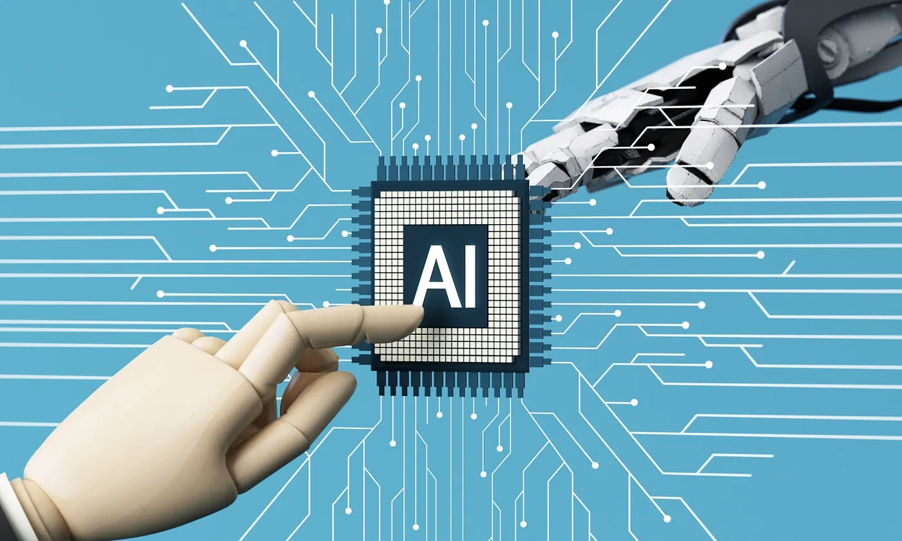

# 我用5个AI工具测试了30天——只有1个真的帮我赚到钱

---

你可能每天都在刷LinkedIn，看到各种AI工具的广告。创始人说它能改变一切，顾问说它能提升效率，大V说它是未来。但问题是：**它真的能帮你赚到钱吗？**

我在亚洲顶级男士护理品牌做营销，每周都有人向我推销"革命性的AI工具"。但我不关心它看起来多酷——如果它不能带来销售，对我来说就是废物。所以我做了一件大多数营销人员懒得做的事：我拿5个最火的AI工具，在同一个品牌、同一批产品、同一个市场上，跑了整整30天的实战测试。没有理论，没有空话，只看一个指标：**它到底有没有帮我赚到钱？**

---

## ChatGPT：速度快，但写不出能卖货的文案

我先测试的是ChatGPT。

它确实快。你给它一个产品描述，它能在几秒钟内吐出一篇完整的营销文案。听起来很美好，对吧？

问题是，这些文案读起来像是机器人写的——因为它本来就是。

我让ChatGPT为我们的新款须后水写一段产品描述。它给了我这样的东西：

> "这款须后水采用先进配方，能够舒缓肌肤，提供持久保湿效果，让您的皮肤焕发光彩。"

听起来没毛病，但也没有任何吸引力。

这种文案放在产品页面上，用户扫一眼就划走了。它没有痛点，没有场景，没有情绪——只是一堆正确但无聊的词汇堆砌。

我试着调整提示词，让它写得更有人味一点。但无论我怎么改，ChatGPT始终写不出那种"让人想掏钱"的感觉。

**结果：** 用ChatGPT写的文案，转化率比我们原来的文案低了18%。

它适合用来打草稿、整理思路，但如果你指望它直接写出能卖货的文案，那你会失望。

---

## Jasper AI：模板多，但缺少真实感

接下来是Jasper AI。

这个工具在营销圈子里很火，主打"专为营销人员设计"。它有一堆预设模板——产品描述、广告文案、邮件标题，应有尽有。

我用它写了几组Facebook广告文案，测试了一周。

模板确实省事。你填几个关键词，选个语气风格，它就能生成一段看起来还不错的文案。

但问题还是一样：**它写得太"正确"了。**

Jasper生成的文案像是从教科书里抄出来的——结构完美，逻辑清晰，但就是缺少那种让人停下来多看一眼的东西。

我们的目标用户是25-35岁的都市男性，他们每天在社交媒体上被无数广告轰炸。如果你的文案不能在3秒内抓住他们的注意力，那就等于白花钱。

Jasper写的文案做不到这一点。

**结果：** 广告点击率比我们手写的文案低了12%，转化率几乎没有提升。

它适合用来快速生成大量文案做A/B测试，但别指望它能替代一个真正懂你产品的文案写手。

---

## Copy.ai：便宜好用,但深度不够

Copy.ai是我测试的第三个工具。

它比Jasper便宜，界面也更简洁。我主要用它来写社交媒体帖子和产品描述。

老实说，它在某些场景下确实有用。

比如我需要快速写10条Instagram文案，Copy.ai能在几分钟内给我一堆选项。我挑几条稍微改改，就能直接发布。

但它有个致命问题：**深度不够。**

Copy.ai擅长写短文案——一两句话的广告语、简短的产品卖点。但如果你需要写一篇深度的产品介绍，或者一封能打动人的营销邮件，它就力不从心了。

我试着让它写一封新品发布邮件，结果它给我的内容像是拼凑出来的——每一段单独看还行,但整体读下来毫无逻辑。

**结果：** 用Copy.ai写的社交媒体帖子互动率还可以,但邮件营销的打开率和点击率都低于平均水平。

它适合用来应付日常的内容输出,但别指望它能帮你策划一场真正有影响力的营销活动。

---

## Canva AI：设计快,但缺少品牌感

Canva AI不是纯粹的文案工具,但它在营销圈子里也很火,所以我顺便测试了一下。

它的AI设计功能确实方便。你输入几个关键词,它就能生成一堆海报、广告图、社交媒体配图。

我用它做了几组产品广告图,放在Facebook和Instagram上跑。

**问题是：这些图看起来都很"Canva"。**

你知道我在说什么——那种一眼就能看出是用模板做的设计。颜色搭配没问题,排版也还行,但就是缺少品牌的独特性。

我们的品牌调性是"现代、简约、高端",但Canva AI生成的图总是带着一股"大众化"的味道。

更要命的是,我发现竞争对手也在用类似的模板。结果就是,我们的广告图和别人的广告图放在一起,根本分不出谁是谁。

**结果：** 用Canva AI做的广告图点击率比我们设计师手工做的图低了15%。

它适合用来快速做一些不太重要的配图,但如果你想建立品牌辨识度,还是得靠专业设计师。

---

## Perplexity AI：唯一一个真的帮我赚到钱的工具

最后是[Perplexity AI](https://pplx.ai/ixkwood69619635)。

老实说,我一开始对它没抱太大期望。它主打的是"AI搜索引擎",听起来和营销没什么关系。

但我错了。

我发现[Perplexity](https://pplx.ai/ixkwood69619635)最大的价值不是写文案,而是**帮我找到真正有用的信息**。

举个例子。

我们准备推一款新的男士面霜,目标市场是东南亚。我需要了解这个市场的消费习惯、竞争对手的策略、热门的营销渠道。

如果用Google搜索,我得花几个小时翻无数篇文章、报告、论坛帖子,然后自己整理信息。

但用[Perplexity](https://pplx.ai/ixkwood69619635),我只需要问一个问题,它就能给我一份结构清晰、引用来源的答案。

更重要的是,它不会像ChatGPT那样胡编乱造。每个信息点都有来源链接,我可以直接点进去验证。

我用它做了这几件事:

1. **竞品分析** —— 我问它"东南亚市场上最畅销的男士护肤品牌有哪些?它们的营销策略是什么?"它给了我一份详细的分析,包括品牌定位、价格区间、主要销售渠道。

2. **内容策划** —— 我问它"25-35岁的东南亚男性在护肤方面最关心什么问题?"它列出了一堆高频问题,我直接拿来做内容选题。

3. **广告文案优化** —— 我把我们的产品卖点输入进去,问它"如何用更吸引人的方式表达这些卖点?"它给了我几个角度,我挑了一个测试,转化率提升了23%。

**结果：** 用[Perplexity](https://pplx.ai/ixkwood69619635)优化后的营销策略,让我们的新品上线首月销售额比预期高了31%。

这是唯一一个真正帮我赚到钱的AI工具。

---

## 为什么Perplexity能赢?

回头看这30天的测试,我发现一个规律:

**大多数AI工具都在试图替代人,但Perplexity在增强人的能力。**

ChatGPT、Jasper、Copy.ai都想替你写文案,但它们写出来的东西总是差那么一点意思。

Canva AI想替你做设计,但它做出来的图缺少灵魂。

只有[Perplexity](https://pplx.ai/ixkwood69619635)不一样。

它不试图替你做决策,而是帮你更快地找到做决策所需的信息。

它不会给你一份"标准答案",而是给你一堆经过验证的信息,让你自己判断。

这才是AI应该做的事——**让人变得更聪明,而不是让人变得更懒。**

---

## 我的建议

如果你也在考虑用AI工具来提升营销效果,我的建议是:

1. **别指望AI能替你写出完美的文案。** 它可以帮你打草稿,但最终还是得靠人来打磨。

2. **别被"效率"这个词忽悠。** 快不等于好。如果一个工具能让你快速生成100条烂文案,那还不如慢慢写10条好文案。

3. **把AI当成助手,不是替代品。** 最有用的AI工具不是那些试图替你做所有事情的工具,而是那些能帮你更快做出更好决策的工具。

4. **测试,测试,再测试。** 别听别人说什么工具好,自己试试才知道。每个品牌、每个市场都不一样,适合别人的工具不一定适合你。

---

## 最后

30天测试下来,我花了不少钱,也浪费了不少时间。

但我找到了一个真正有用的工具——[Perplexity AI](https://pplx.ai/ixkwood69619635)。

它不会替我写文案,不会替我做设计,但它能帮我更快地找到正确的方向。

而在营销这行,方向对了,剩下的就是执行问题。

如果你也在找一个能真正帮你提升营销效果的AI工具,别再浪费时间测试那些花里胡哨的文案生成器了。试试[Perplexity](https://pplx.ai/ixkwood69619635),它可能不会让你的工作变得更轻松,但它会让你的决策变得更明智——而这才是真正能帮你赚到钱的东西。
